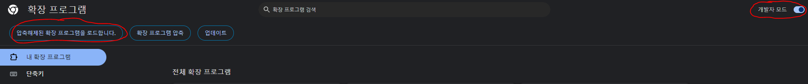

## 웹페이지 자동 스크롤 기능 extension

### 설명
- 웹 페이지 글을 스크롤 하기 귀찮아서 만든 크롬 익스텐션
- 나는 웹 페이지 글을 읽을 때, 화면을 띄워놓고 팔짱을 끼고 읽는다.
- 화면에 보이는 부분을 다 읽으면 수동으로 스크롤 해줘야 한다.
- 스크롤을 해야할 때마다 팔짱을 풀어야 하는 귀찮음 비용이 생긴다.
- 해당 비용을 아끼고자 해당 익스텐션을 개발했다.
- 본인의 읽는 속도에 맞춰 3가지 경우(느림, 보통, 빠름)로 스크롤 이동 속도 설정이 가능하다.
- 버튼을 누름으로써 해당 기능 on/off가 가능하다.

### 사용 방법
- chrome://extensions/ 혹은 '설정 -> 확장 프로그램 -> 확장 프로그램 관리'에 들어간다

- 우측 상단에 "개발자 모드"를 켠다.
- 좌측 상단에 "압축해제된 확장 프로그램을 로드합니다." 클릭
- git clone 한 폴더를 선택, 등록하면 됩니다.

**Happy Scroll!!**